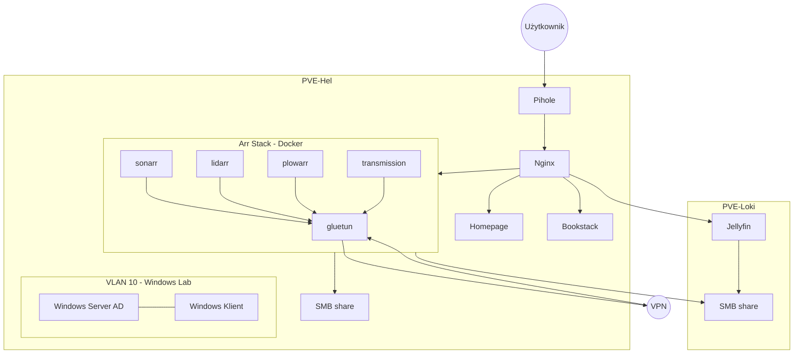

# 🚀 Homelab
> "From Functional Chaos to Enterprise Standards"

Dokumentacja mojego domowego laboratorium opartego na dwóch niezależnych jednostkach Mini-PC. Projekt jest poligonem doświadczalnym dla technologii wirtualizacji, konteneryzacji oraz administracji systemami Windows/Linux.

---
### Cel i geneza
Celem projektu i to dlaczego w ogóle to zacząłem robić jest nauka i zgłębianie mojego zainteresowania. Równie ważnym powodem dla mnie jest przekonanie że w obecnych czasach dominuje model subskrypcyjny na praktycznie każde usługi w internecie czy dostęp do mediów co skutkuje tym że nie posiadamy niczego na wyłączność. Innym powodem jest zadbanie o prywatność i zabezpieczeniu swoich danych.

---

## 📊 Stan obecny: v1.0
Obecnie lab znajduje się w fazie intensywnego wdrażania usług. Priorytetem jest **dostępność (uptime)** i **funkcjonalność**. 

- ### ✅ Zrobione
	- Instalacja i konfiguracja Proxmox na obu maszynach
	- Uruchomienie wybranych usług na kontenerach LXC
	- Przygotowanie bezpiecznego środowiska do nauki Windows Serwer
	- Zdalny dostęp
	- Lokalny DNS i blokowanie reklam
 - ### 🛠️ W trakcie
	- Dokumentacja obecnej topologii i konfiguracji usług
 - ### 📊 Do zrobienia
   - Strona domowa homelaba
   - Rozbudowa głownego serwera i migracja usług
---
## 🏗️ Infrastruktura Sprzętowa

| Host | Model | CPU | RAM | Rola |
| :--- | :--- | :--- | :--- | :--- |
| **PVE-Loki** | HP ProDesk 400 G5 | 6C/6T | 8GB | Najważniejsze usługi i magazyn danych |
| **PVE-Hel** | HP EliteDesk 800 G2 | 4C/4T | 32GB | Windows Lab i testowanie |

---

## 🛠️ Stos Technologiczny i Usługi

### 🎬 Media i dane
Centralny punkt rozrywki i przechowywania danych, zarządzany głównie przez kontenery LXC i Docker.
* **Jellyfin:** Prywatny serwer strumieniowania wideo.
* **Samba Server:** Sieciowy magazyn plików (NAS) dla urządzeń domowych.
* **"Arr" Stack:** Automatyzacja biblioteki mediów (Sonarr, Radarr, Prowlarr, Transmission, Gluetun).

### 🖥️ Windows Lab
W pełni odizolowane środowisko do nauki administracji systemami Microsoft.
* **Windows Server 2022:** Active Directory, DNS, DHCP, GPO Management.
* **Windows Client:** Stacja robocza do testowania polityk domenowych.

### 🌐 Sieć i przepływ ruchu
Zarządzanie ruchem w sieci, bezpieczeństwo i usprawnienie użytkowania
* **Reverse Proxy (Nginx Proxy Manager):** Obsługuje certyfikaty SSL i kieruje ruch do odpowiednich usług bez wystawiania ich bezpośrednich portów.
* **Pihole:** Lokalny serwer DNS, blokuje reklamy dla urządzeń z niego korzystających 
* **VLAN:** Separacja ruchu laboratorium Windows od reszty sieci, co zwiększa bezpieczeństwo sieci domowej.
* **Tailscale** Bezpieczny dostęp do usług z poza sieci domowej
---

## 🗺️ Schemat Architektury

# 🚀 v2.0
  ### Plany na dalszy rozwój projektu
  - Monitorowanie ruchu w sieci
  - Powiadomienia o incydentach, które wymagają podjęcia działania
  - Klucze SSH zamiast haseł
  - Migracja usług z kontenerów z użytkownikiem root na dedykowanych użytkowników
  - Kopie zapasowe
