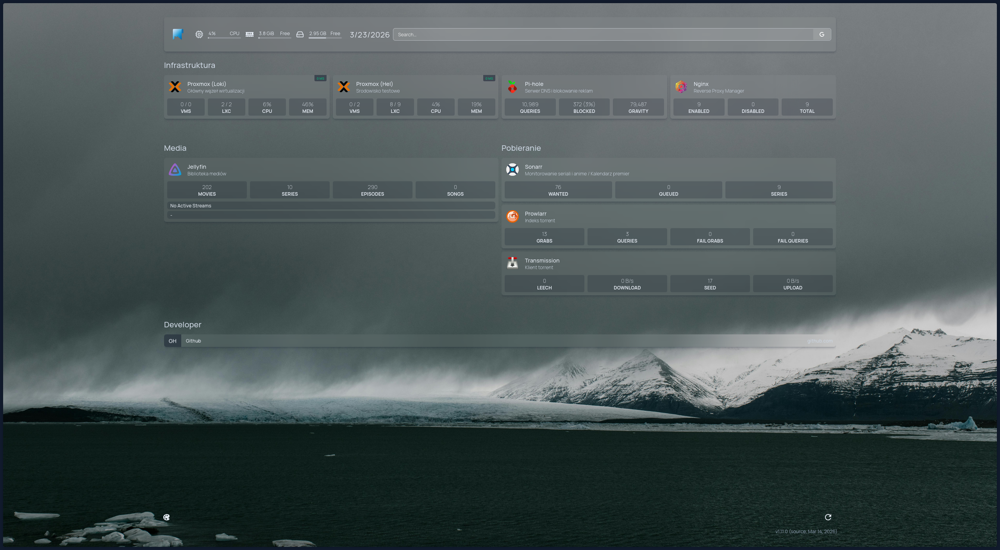
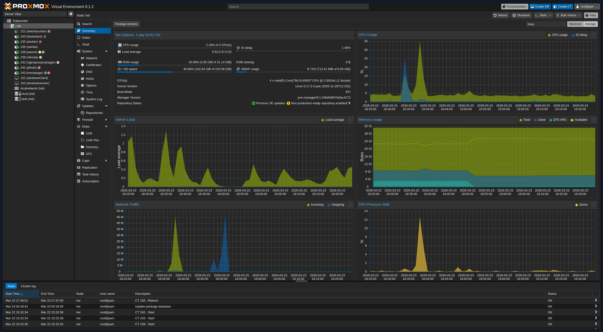
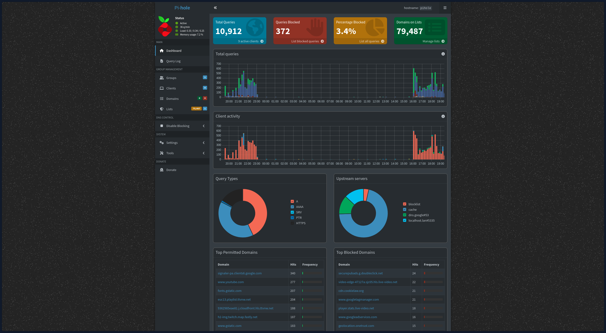
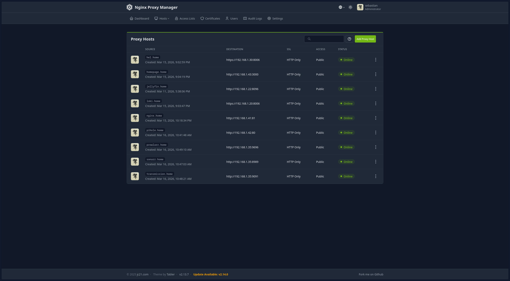
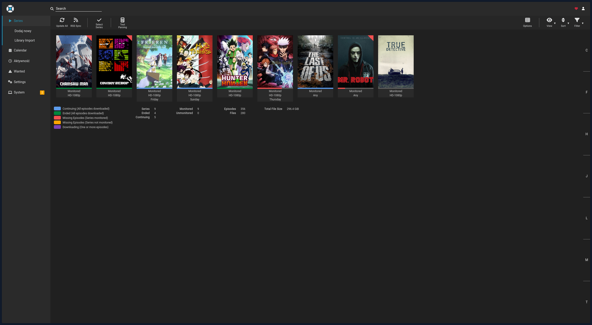

# 📁 Homelab

Dokumentacja mojego domowego laboratorium opartego na dwóch niezależnych jednostkach PC. Projekt jest poligonem doświadczalnym dla technologii wirtualizacji, konteneryzacji oraz administracji systemami Windows/Linux.

---
### 🎯 Cel i geneza
Celem projektu i to dlaczego w ogóle to zacząłem robić jest nauka i zgłębianie mojego zainteresowania. Równie ważnym powodem dla mnie jest przekonanie że w obecnych czasach dominuje model subskrypcyjny na praktycznie każde usługi w internecie czy dostęp do mediów co skutkuje tym że nie posiadamy niczego na wyłączność. Innym powodem jest zadbanie o prywatność i zabezpieczeniu swoich danych.

## 🖥️ Specyfikacja
| Host | Rola | CPU | RAM |
| :--- | :--- | :--- | :--- |
| **Mimir** | Główny serwer | i5-11400 | 16GB |
| **Hel** | Środowisko testowe i Windows Serwer | i5-6500T | 32GB |

## 🏗️ Architektura usług

Każda usługa (grupa usług jeżeli są powiązane ze sobą) żyje w osobnym kontenerze LXC lub maszynie wirtualnej na wirtualnym środowisku Proxmox (PVE):

1. **LXC "pihole"** – Pi-hole, lokalny serwer DNS + blokowanie reklam.
2. **LXC "monitoring"** – Uptime Kuma (monirorowanie kontenerów LXC i samego serwera Proxmox).
3. **LXC "media"** – Jellyfin + Gluetun + Transmission + Prowlarr + Sonarr + Radarr, wszystko razem w jednym kontenerze
4. **VM windows server i VM windows 10** - Dwie osobne ale powiązane ze sobą wirtualne maszyny odseparowane od reszty sieci w osobnym VLAN
5. **LXC samba** - Prosty kontener, którego zadaniem jest serwowanie plików przez sieć
6. **LXC homepage** - Pulpit nawigacyjny homelaba, zawiera odnośniki do każdej usługi
7. **LXC hermesagent** - Kontener testujący lokalne modele językowe sztucznej inteligencji

## 🗂️ Szablony usług Docker

1. `pihole/docker-compose.yml` – Pi-hole (DNS + blokowanie reklam).
2. `monitoring/docker-compose.yml` – Uptime Kuma.
3. `media/docker-compose.yml` – Gluetun + Transmission + Prowlarr + Sonarr + Radarr + Jellyfin.
4. `media/.env.example` – Szablon zmiennych środowiskowych dla sieci VPN.

## 🌐 Adresacja IP

Sieć domowa: `192.168.1.0/24`. Kontenery LXC  dostają statyczne adresy w kolejności wdrażania:

| Host/LXC | Adres IP |
|---|---|
| Host proxmox(mimir) | `192.168.1.20` |
| LXC pihole | `192.168.1.21` |
| LXC media | `192.168.1.22` |
| LXC monitoring | `192.168.1.23` |
| Host proxmox(hel) | `192.168.1.30` |
| VM windows server | `10.0.0.1` |
| VM windows 10 | `10.0.0.2` |
| LXC samba | `192.168.1.36` |
| LXC homepage | `192.168.1.43` |
| LXC hermesagent | `192.168.1.44` |

## 🔗 Dostęp zdalny (Tailscale)

Tailscale zainstalowany osobno w każdym LXC. Dostęp do nich mają tylko urządzenia znajdujące się w sieci Tailscale. Dzięki temu sieć domowa jest bezpieczna i nie potrzeba wystawiać żadnej usługi do internetu.

# 🎞️ Zrzuty ekranu

